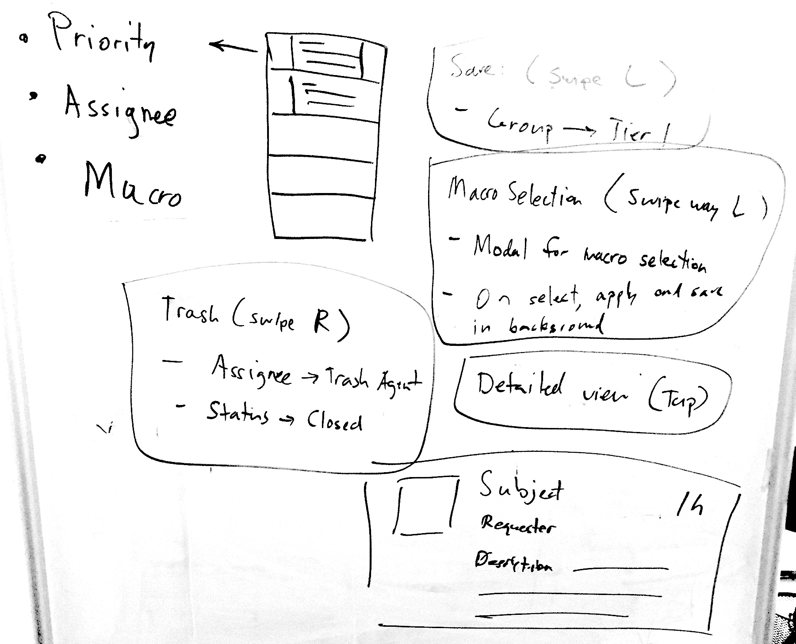
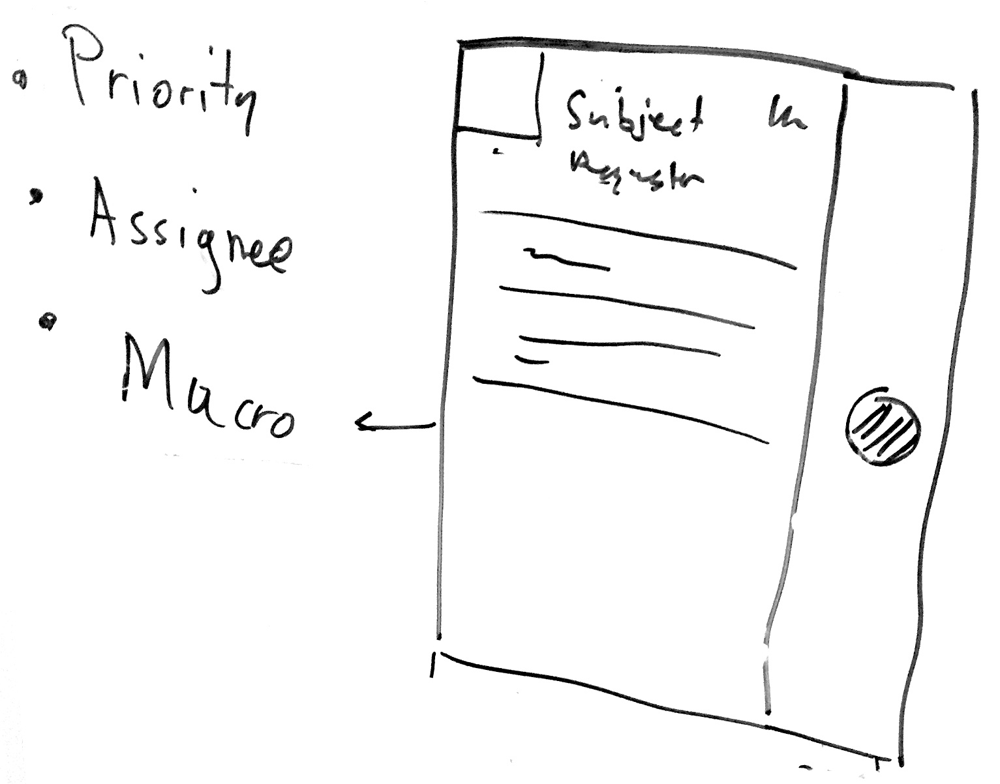
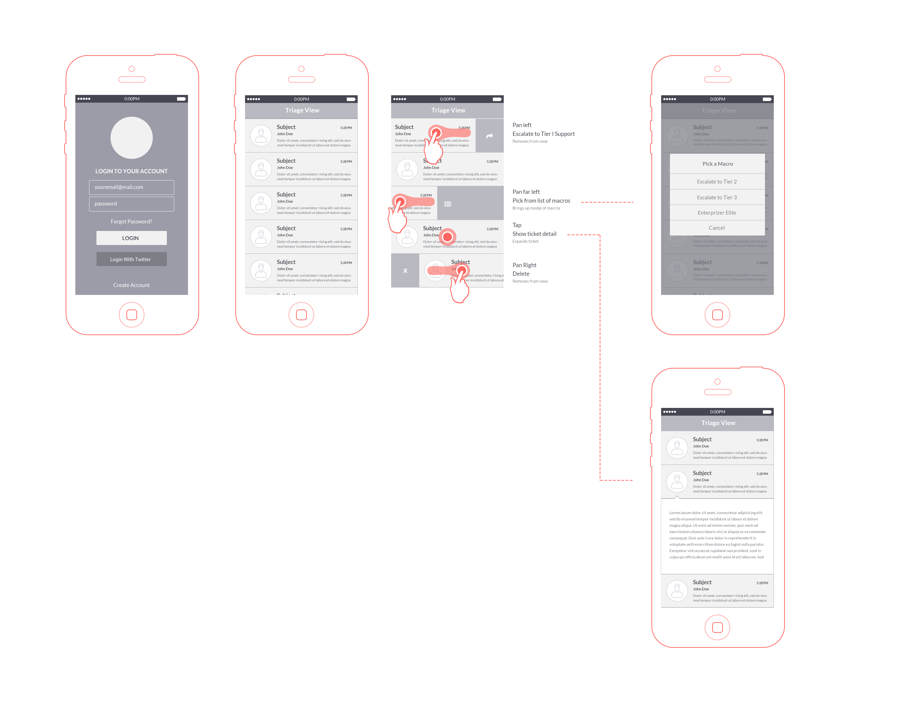

## Zendesk Triage App

We are using the Inbox app as our inspiration. The goal of this app is to enable agents to quickly and simply triage the majority of zendesk tickets in a queue. 

This app will agents to quickly delete or esclate each ticket to the apporiate tier. 

## Views

1. Login view: (Email, Password, Zendesk Subdomain)
2. Main view: This view will list the most recently updated tickets in a zendesk triage view. Users will be able to swipe at the cell to perform triage actions 
3. Detail view: The view will list more detail about a ticket. 

### Login View

[Login] [Password] [Subdomain] [Submit]

### Main View

#### Swipe Actions

1. Half left swipe (assign to Tier 1)
2. Full left swipe (assign to specific tier)
3. Right swipe. Delete ticket 

### Detail View

### Wireframe

